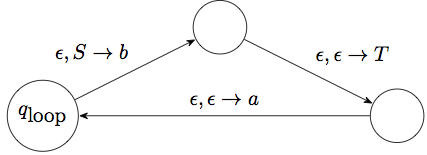

# Context Free Languages and Pushdown Automata

## The pumping lemma for context-free languages

The pumping lemma for context-free languages is a bit more complicated:

> **Pumping Lemma for CFLs**
>
> If A is a context-free language, then there is a number $p$, so that any string $s\in A$ of length at least $p$ may be divided into $5$ pieces $s=uvxyz$ so that:
>
> 1. $uv^ixy^iz\in A$ for all $i\geq 0$,
> 2. $|vy| > 0$,
> 3. $|vxy|\leq p$.

So instead of having a single piece that can be pumped, it has two pieces that are "pumped together". Condition 2 says that at least one of the strings $v,y$ is non-empty.

Key idea: A derivation for a long-enough string can be broken into two intermediate steps:
$$S \Rightarrow^* uRz$$
$$R \Rightarrow^* vRy$$
$$R \Rightarrow^* x$$
The middle step can be repeated any number of times to produce the various pumped versions of the string.

### Examples of non-context-free languages

We can use the pumping lemma to conclude that a number of languages are not context-free.

> The language $B=\left\{ a^nb^nc^n\mid n\geq 0 \right\}$ is not context-free. In general, any language that requires three parts to all change together is likely to not be context-free.

Sketch of proof: Suppose that $B$ was context-free, and hence there is a CFG generating it. Let $N$ be the pumping length, and consider the string $s=a^N b^N c^N\in B$. This string cannot be pumped while staying in $B$:

The pumping lemma guarantees that we can write $s=uvxyz$ where $|vxy|\leq N$. Therefore this part cannot contain both $a$s and $c$s, as it is not long enough to cross over all the $b$s. It may also consist of only $b$s.

This means that $uv^2xy^2z\in B$ has an unequal number of $a$s and $c$s. This is a contradiction.

## Pushdown automata

Pushdown automata are some times called "stack machines". They are an extension of finite automata, where we are allowed a "stack" to store information. We should start with a quick reminder of stacks:

### Stacks

> A **stack** is a structure on which you can do mainly two things:
>
> - You can add a new element at the "top". This is called a **push**.
> - You can remove and look at the element at the top. This is called a **pop**.
>
> A stack in our usage does not allow you to see what elements are under the top element. But you may *peek* at the top element.
>
> Stacks start their "life" empty, and grow and shrink in size as we push and pop elements in them. The key thing to remember is the LIFO behavior: The last thing in is the first thing out.

### Pushdown Automata

The idea of pushdown automata is similar to that of finite automata:

- We have a finite set of states $Q$, and transitions between them.
- One state is the start state. Zero or more states are the accept states.
- There is a stack, and it is related to the transitions:
    - A transition depends on 3 things: The state we are in, the input we will consume, if any, and the element at the top of the stack that we will pop, if any (we can choose not to pop anything from the stack).
    - A transition returns 2 things: The new state, and an element to be pushed at the top of the stack, if so desired.

So formally, a pushdown automaton is defined thus:

> A **(nondeterministic) pushdown automaton** is a 6-tuple $(Q,\Sigma,\Gamma, \delta, q_0, F)$ where:
>
> - $Q$ is a finite set of states, including a start state $q_0$.
> - $F\subset Q$ is the set of accept states.
> - $\Sigma$ is a (finite) alphabet (the terminals in our CFG case).
> - $\Gamma$ is the (finite) set of possible stack symbols (symbols that can be stored in the stack). Typically this will include $\Sigma$, and occasionally other special symbols (for example the non-terminal symbols from a related CFG).
> - $\delta\colon Q\times\Sigma_\epsilon \times \Gamma_\epsilon \to \mathcal{P}\left(Q\times\Gamma_\epsilon\right)$ is a (nondeterministic) transition function which possibly pops a stack element, possibly reads a input symbol, and possibly pushes a symbol to the stack.
>
> Here $\Sigma_\epsilon$ and $\Gamma_\epsilon$ represents the sets $\Sigma\cup\{\epsilon\}$ and $\Gamma\cup\{\epsilon\}$ respectively.

Note that we only look at nondeterministic pushdown automata. Deterministic pushdown automata are **NOT** equivalent to them, but we will not consider them here.

### Computation in a Pushdown Automaton

> Computation in a pushdown automaton:
>
> - The automaton starts at the start state $q_0$ and with an empty stack and at the beginning of the input.
> - When on a state $q$, the automaton nondeterministically chooses a transition amongst the available transitions coming from 4 sets:
>     - Transitions of the form $\delta(q, \epsilon, \epsilon)$. In this case it does not consume any input and it does not pop anything from the stack (but it might push something).
>     - Transitions of the form $\delta(q, a, \epsilon)$. In this case the next input should be $a$ and it will be consumed advancing the tape head, and nothing is popped from the stack.
>     - Transitions of the form $\delta(q, \epsilon, s)$. In this case no input is consumed, but the top of the stack should be $s$ and it is popped.
>     - Transitions of the form $\delta(q, a, s)$. In this case the next input must be $a$ and is consumed advancing the tape head, and the top of the stack must be $s$ and it will be popped.
> - If the automaton has consumed all input and has made it to an accept state (possibly following some of the $\epsilon$-input possibilities above once it has consumed all input), then it accepts the string.
>
> The language of the automaton is the set of all strings that the automaton accepts.

NOTE 1: Unlike the version of NFAs that we saw, we require our PDAs to consume the whole input string before the string can be accepted. Reaching an accept state is by itself not sufficient.

NOTE 2: As is usual with non-deterministic automata, the string is accepted as long as there is one branch of the computation tree that leeds to acceptance. So a single "yes" on the tree is all you need.

For example consider the language:

$$L = \left\{ x^ny^m \mid n \geq m \geq 0 \right\}$$

So the language allows any number of $x$'s followed by no more than that many $y$'s. Here is an automaton that will recognize the language. We will use the stack to count how many $x$'s we have seen that have not been matched by corresponding $y$'s.

- $\Sigma=\{ x, y \}$.
- $\Gamma = \{ x \}$ as we will only put $x$'s in the stack.
- $Q = \{ q_0,q_1 \}$ has a start state and one more state.
- $F = \{ q_1 \}$ we have to make it to $q_1$ after consuming all the input in order to accept.
- $\delta(q_0, x, \epsilon) = \left\{(q_0, x)\right\}$. As long as we see $x$'s we push them to the stack.
- $\delta(q_0, \epsilon, \epsilon) = \left\{(q_1, \epsilon)\right\}$ at any time, non-deterministically, we can decide to stop consuming $x$'s and prepare for consuming the $y$'s.
- $\delta(q_1, y, x) = \left\{(q_1, \epsilon)\right\}$. As long as we can find an $x$ in the stack, we can consume a $y$ (and pop that $x$).
- All other $\delta$ values are empty sets.

Here is a visual representation:


Now let us try a slightly more difficult language:

$$L = \left\{ x^ny^n \mid n \geq 0 \right\}$$

This is a bit different than the previous example. In the previous example we did not need to know that the stack was empty before returning. In fact there might be a bunch of $x$'s left in the stack. All we had to make sure is that we don't consule a $y$ unless there is an $x$ on the stack to match it.

This case is different. We will need to know when we have taken all the $x$'s out of the stack, because it is only at that time that they are matched to the $y$'s. By default there isn't really an automatic mechanism for detecting that the stack is empty. But we can build one ourselves, and from now on we will do these steps without thinking about them much:

> How to check for empty stack:
>
> - Add a new stack symbol, not existing in $\Gamma$. We denote it by $\$$.
> - Add a new start state, with a transition $\epsilon,\epsilon\to\$$ to the previous start state. This adds this special symbol at the bottom of the stack. Popping that symbol later on tells us that the stack has been emptied.
> - At any place where you need to test for end of input, add a transition $\epsilon,\$\to \epsilon$ to a new final state.

Let us illustrate this with a pushdown automaton for the language $L$ described above:

- $\Sigma=\{ x, y \}$.
- $\Gamma = \{ x, \$ \}$.
- $Q = \{ q_0, q_1, q_2, q_3 \}$.
- $F = \{ q_3 \}$.
- $\delta(q_0, \epsilon, \epsilon) = \left\{(q_1, \$)\right\}$.
- $\delta(q_1, x, \epsilon) = \left\{(q_1, x)\right\}$.
- $\delta(q_1, \epsilon, \epsilon) = \left\{(q_2, \epsilon)\right\}$.
- $\delta(q_2, y, x) = \left\{(q_2, \epsilon)\right\}$.
- $\delta(q_2, \epsilon, \$) = \left\{(q_3, \epsilon)\right\}$.
- All other $\delta$ values are empty sets.


In fact this chain of four states is a very common pattern for pushdown automata. What changes from example to example is the transitions around $q_1$ and $q_2$.

**Exercise 1**: Work out a PDA for the language that consists of all palindromes on the alphabet $\{a,b,c\}$.

**Exercise 2**: Work out a PDA for the language that consists of all strings of matched parentheses (e.g. `(()(()()))`).

**Exercise 3**: Work out a PDA for the language that consists of all strings of $x$s and $y$ containing an equal number of $x$s and $y$s (but not requiring all $x$s before all $y$s).

### Simplifying the PDA

There are some convenient things we can do to simplify a PDA. First of all, we can of course assume that there is only one accept state, by instead $\epsilon$-transitioning to a new state from all the accept states like we would do in an NFA. But the nice thing in our case is that we can also empty the stack first:

> For any PDA there is an equivalent PDA with a single accept state and which only accepts with an empty stack. We call these *strict PDAs*.

The process for constructing this strict PDA is somewhat simple:

- We add a new "end of stack symbol" like we did in the previous example, and a new start state that puts it on the stack.
- We add a new state $q_e$ that all the old accept states would $\epsilon$-transition to.
- We add transitions $\epsilon,s\to\epsilon$ from $q_e$ to itself for each stack symbol $s$ except for the new "end of stack symbol". This effectively empties the stack.
- We add a new state $q_{acc}$ that is the final state, and a transition $\epsilon,\$\to\epsilon$ from $q_e$ to it. So the only way we will transition to $q_{acc}$ and hence accept is when we've reached the end of stack symbol.

## Equivalence between CFGs and PDAs

It turns out that CFGs and PDAs represent the same set of languages. We consider here only one half of the equivalence:

> Given a context-free language, we can construct a PDA that decides the same language.
>
> (The converse is also true).

### Construction

The idea is somewhat straightforward.

- There is a main chain of 4 states, with auxiliary states that form "loops", one loop for each production rule.
- We start by placing the "end of stack" symbol and the start variable on the stack.
- At any given time we can either:
    - match the top of the stack with the next input, and hence advance the input, or
    - replace the non-terminal at the top of the stack with the right-hand-side of a production rule for it. This is done in a sequence of states that ends up forming a loop.
- The accept state can be reached only by popping the "end of stack" symbol. This can only be seen if a derivation from the start variable was successfully matched by the input.

Here is the basic picture:


The "loops" around $q_\textrm{loop}$ correspond to the production rules in the grammar. Each loop is a shorthand for a sequence of states. For instance if we have a production rule like $S\to aTb$, this would produce the following "loop":



We usually skip the intermediate states in the process and just write this path as a self-loop with transition $\epsilon,S\to aTb$.

The graph also contains self-loops on $q_\textrm{loop}$ with transitions $t,t\to\epsilon$, for each terminal symbol $t$. These self-loops allow us to advance the input every time we get a terminal at the top of the stack.

This completes the construction of the PDA.

Here is an example of this idea in action. Consider the language produced by the grammar:
```
S -> aSa | bSb | epsilon
```
In addition to the standard 4 states, it contains:

- 2 states that establish the loop $\epsilon,S\to aSa$,
- 2 states that establish the loop $\epsilon,S\to bSb$,
- a self-loop for $\epsilon,S\to \epsilon$, corresponding to the rule `S -> epsilon`,
- the two self-loops $a,a\to\epsilon$ and $b,b\to\epsilon$.

Now consider the string `abbaabba`. Here is how it would be computed by this automaton:

```
Input       Stack     Step from previous                          Derivation
---------   --------  ------------------------------------------- ------------------------
abbaabba    $S        (moved to loop state)
abbaabba    $aSa      eps,S -> aSa                                S => aSa
bbaabba     $aS       a,a   -> eps
bbaabba     $abSb     eps,S -> bSb                                => abSba
baabba      $abS      b,b   -> eps
baabba      $abbSb    eps,S -> bSb                                => abbSbba
aabba       $abbS     b,b   -> eps
aabba       $abbaSa   eps,S -> aSa                                => abbaSabba
abba        $abbaS    a,a   -> eps
abba        $abba     eps,S -> eps                                => abbaabba
bba         $abb      a,a   -> eps
ba          $ab       b,b   -> eps
a           $a        b,b   -> eps
eps         $         a,a   -> eps
eps         eps       eps,$ -> eps   (moving to accept state)
```

**Exercise 4**: Build the PDA for the grammar of the following language for arithmetic. Show all the loops:
```
E -> T | E + T
T -> F | T * F
F -> v | n
```
